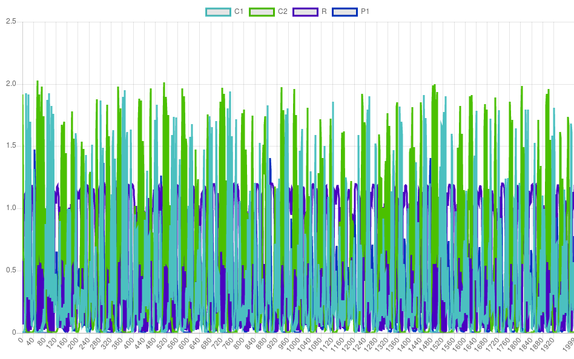
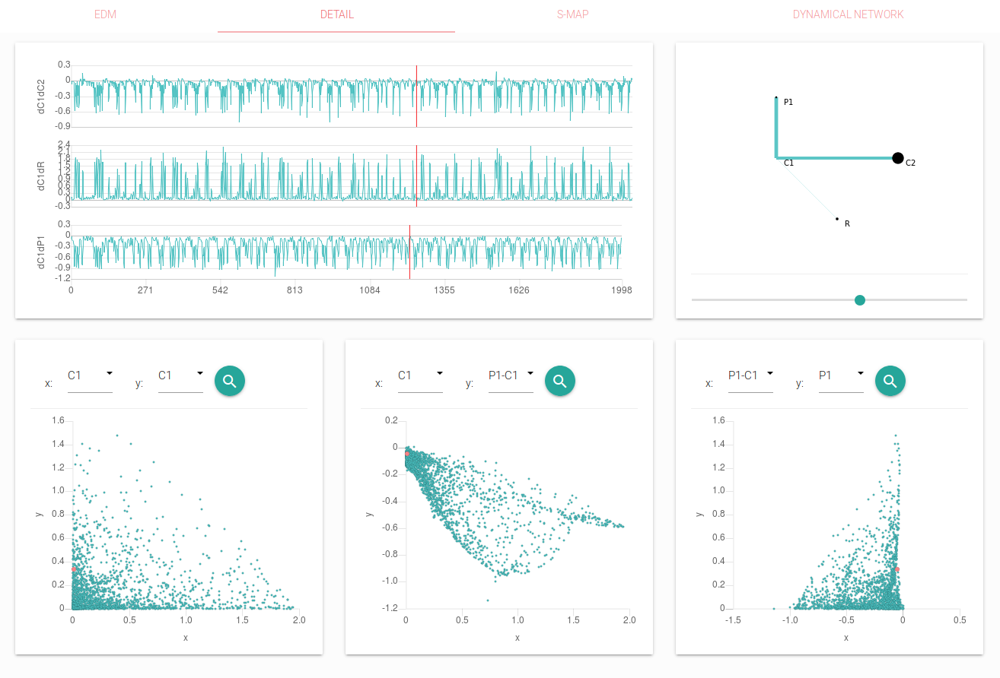
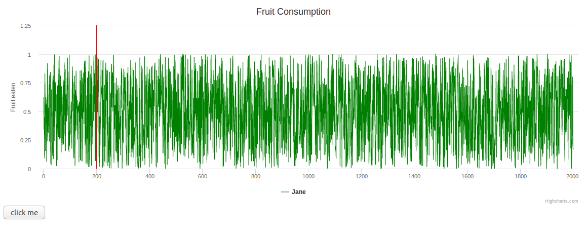

# Description
This repository is aimed to displayed all kinds of visualization graph

# canvas

# three.js

# [ploty.js](https://github.com/plotly/plotly.js)

# [chart.js](https://github.com/chartjs/Chart.js)

Nowdays, I create this scene by chartjs.

# [highcharts](https://www.highcharts.com/)

linechart

